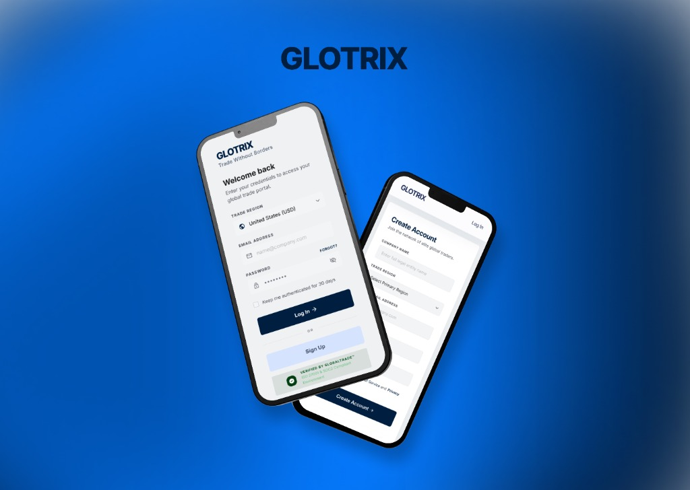

# Subeek Loganathan — AI-Powered UI/UX Designer Portfolio

A premium, interactive, and high-performance portfolio showcasing UI/UX design excellence, agentic design workflows, and product architecture.

## 🚀 Features
- **Modern Sci-Fi Aesthetic**: High-impact visual design with glassmorphism and mesh gradients.
- **Dynamic Interactions**: Typewriter effects, particle animations, and hover tilt effects for project cards.
- **Theme Versitility**: Seamless transition between high-contrast dark mode and premium light mode.
- **Deep Case Studies**: Comprehensive documentation of research, process, and impact for major projects (Glotrix, Learnix).
- **SEO Optimized**: Fully refined metadata, Open Graph tags, and accessibility-compliant HTML.
- **Fully Responsive**: Optimized for desktop, tablet, and mobile devices.

## 🛠️ Technology Stack
- **Structure**: Semantic HTML5
- **Styling**: Vanilla CSS (Custom Properties, Flexbox, CSS Grid)
- **Logic**: Vanilla JavaScript (ES6+)
- **Design Tools**: Figma, Illustrator, Photoshop

## 📂 Project Structure
- `index.html`: Main landing page and hero section.
- `glotrix.html`: B2B Global Trade mobile app case study.
- `learnix.html`: EdTech & Productivity app case study.
- `portfolio.css`: Core design system and layout logic.
- `portfolio.js`: Interactivity, theme toggling, and animations.

## 📬 Contact
- **Email**: [subeeks2007@gmail.com](mailto:subeeks2007@gmail.com)
- **Behance**: [behance.net/subeeks2007](https://www.behance.net/subeeks2007)
- **Location**: Coimbatore, Tamil Nadu, India

---
*Designed & Built by Subeek · 2026*
